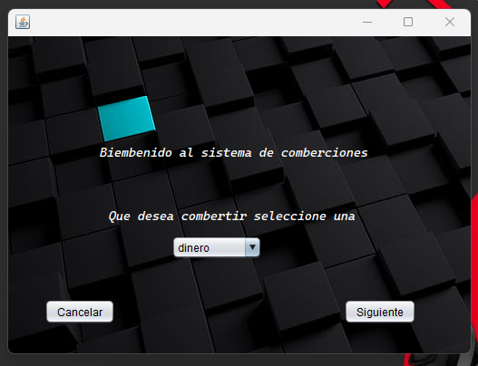
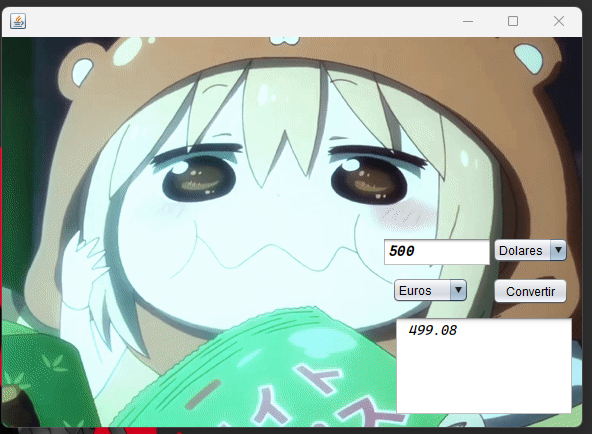
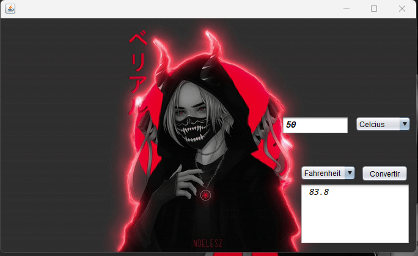

# Challenges Back of Alura


## 🐍 Summary 🐍

This Java Application consists of three JFrame forms that provide different functionalities to the user. The first form is the Menu, where available options are presented. The second form is the Dollars and Euros Converter, allowing the user to convert an amount of money between dollars and euros. The third form is the Celsius and Fahrenheit Converter, enabling the user to convert a temperature between degrees Celsius and Fahrenheit.

The application provides an interactive interface for the user to select the desired option and perform the corresponding conversions. Each form may contain input fields, buttons, and visual elements necessary to carry out the conversions intuitively. The user can navigate between the forms and perform multiple conversions as needed.

In summary, this Java Application aims to provide a set of conversion tools, including an option to convert between dollars and euros and another option to convert between degrees Celsius and Fahrenheit.

### This is the menu


### Money Converter


### Degree Converter


## Introduction

This project is a Java application that provides conversion tools, including a dollars and euros converter and a Celsius and Fahrenheit converter. It offers an intuitive interface for users to perform quick and efficient conversions between different units.

## 👻 Installation
clone this repository

```
https://github.com/juniorDeveloper8/conversor.git

```
## 👽 Dependencies
```
 • JDK 20 of java optional
```

## Author

Roberth Zambrano
